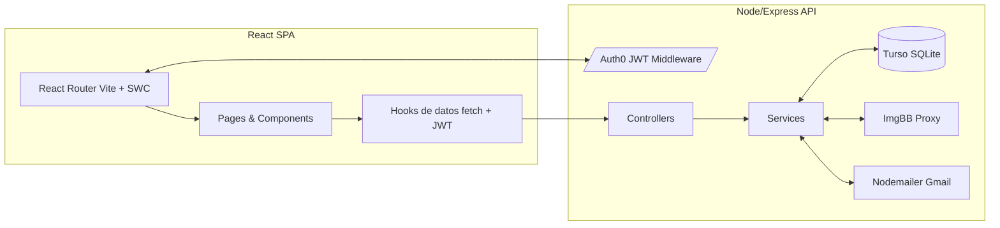
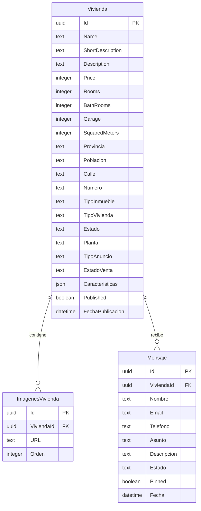
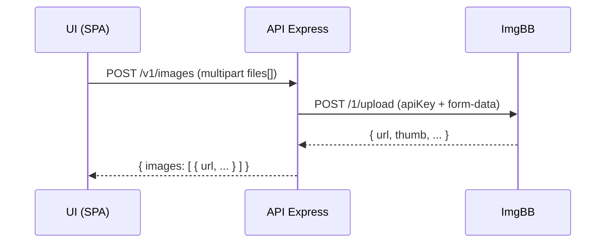

Provide project context and coding guidelines that AI should follow when generating code, answering questions, or reviewing changes.

# Documentación Técnica

# Documentación Técnica – Web Inmobiliaria

> Proyecto: Portal inmobiliario con catálogo de viviendas, detalle, formulario de contacto, panel básico y flujos de alta de inmuebles. Front en React (Vite + SWC), backend en Node.js (Express), BBDD SQLite (Turso), subida de imágenes a ImgBB, mensajes por correo vía Nodemailer + Gmail (OAuth2), y autenticación con Auth0 + control de roles.
> 

---

## 1) Resumen y alcance

- **Objetivo**: construir una web inmobiliaria moderna, accesible y performante que permita listar, buscar y gestionar viviendas, mostrar fichas detalladas y recibir mensajes de contacto.
- **Usuarios**:
    - **Anónimo**: navega, lista, busca, ve detalle, envía mensajes.
    - **User** (autenticado): igual que anónimo + puede guardar favoritos (futuro), iniciar pautas de contacto.
    - **Captador**: crea borradores de viviendas.
    - **Seller**: publica/edita viviendas propias.
    - **Admin**: CRUD completo, gestión de mensajes y usuarios.

---

## 2) Stack tecnológico

**Frontend**

- React 18, React Router 6, JavaScript ES2022
- Vite + SWC (bundling transpile rápido)
- CSS utilitario (tokens + módulos CSS/Tailwind opcional)
- Herramientas: ESLint, Prettier, Vitest + React Testing Library

**Backend**

- Node.js 20, Express 4
- BBDD: Turso (SQLite remoto) via `@libsql/client`
- Utils: zod (validación), pino (logging), helmet (seguridad), morgan (access logs), rate-limiter-flexible (rate limit)

**Integraciones**

- **Auth0** (SPA + API con RBAC y JWT)
- **ImgBB** (subida de imágenes vía backend proxy)
- **Gmail** + Nodemailer (OAuth2) para mensajes de contacto

**DevOps**

- CI/CD: GitHub Actions (lint + test + build + deploy)
- Deploy: Front (Vercel), API (Render), DB (Turso cloud)

---

## 3) Arquitectura (visión general)



**Principios**

- Separación de responsabilidades (Controller → Service → Repo/DB).
- Backend como **BFF**: orquesta DB, ImgBB y envío de emails.
- Frontend SPA con **protección por roles** y rutas privadas.

---

## 4) Estructura de repositorio

### FrontEnd

```
/ (monorepo opcional)
├─ frontend/
│  ├─ src/
│  │  ├─ app/ (router, providers)
│  │  ├─ pages/ (Home, Listado, Detalle, Vender, Admin)
│  │  ├─ components/ (UI reusables, tarjetas, chips, formularios)
│  │  ├─ hooks/ (useAuth, useFetch, useViviendas)
│  │  ├─ services/ (api client, endpoints)
│  │  ├─ styles/ (tokens, variables)
│  │  ├─ utils/ (helpers, formatters)
│  │  └─ types/
│  ├─ index.html / main.jsx / vite.config.js
│  └─ .env (VITE_*)

```

### Backend

```
backend/
   ├─ src/
   │  ├─ app.ts (bootstrap Express)
   │  ├─ routes/ (viviendas, mensajes, images)
   │  ├─ controllers/
   │  ├─ services/
   │  ├─ repos/ (db queries)
   │  ├─ db/
   │  │  ├─ client.ts (libsql)
   │  │  ├─ migrations/
   │  │  └─ seeds/
   │  ├─ middlewares/ (auth0, errors, rate-limit)
   │  ├─ schemas/ (zod DTOs)
   │  └─ utils/
   ├─ .env
   └─ Dockerfile (opcional)
```

---

## 5) Modelo de datos

### Entidades principales

- **Vivienda**: Id (uuid), Name, ShortDescription, Description, Price, Rooms, BathRooms, Garage, SquaredMeters, Provincia, Poblacion, Calle, Numero, TipoInmueble, TipoVivienda, Estado, Planta, TipoAnuncio, EstadoVenta, Caracteristicas (JSON), Published (bool), FechaPublicacion, imagenes (relación 1:N).
- **ImagenesVivienda**: Id, ViviendaId (FK), URL, Orden.
- **Mensaje**: Id, ViviendaId (FK), Nombre, Email, Telefono, Asunto, Descripcion, Estado, Pinned, Fecha.
- **UserRole**: Admin, User, Captador, Seller (vienen de Auth0 como claims/roles).

### Diagrama ER



### Esquema SQL (Turso/SQLite)

```sql
CREATE TABLE IF NOT EXISTS Vivienda (
  Id TEXT PRIMARY KEY,
  Name TEXT NOT NULL,
  ShortDescription TEXT,
  Description TEXT,
  Price INTEGER NOT NULL CHECK(Price >= 0),
  Rooms INTEGER DEFAULT 0,
  BathRooms INTEGER DEFAULT 0,
  Garage INTEGER DEFAULT 0,
  SquaredMeters INTEGER CHECK(SquaredMeters >= 0),
  Provincia TEXT,
  Poblacion TEXT,
  Calle TEXT,
  Numero TEXT,
  TipoInmueble TEXT,
  TipoVivienda TEXT,
  Estado TEXT,
  Planta TEXT,
  TipoAnuncio TEXT,
  EstadoVenta TEXT,
  Caracteristicas TEXT, -- JSON string
  Published INTEGER DEFAULT 0,
  FechaPublicacion TEXT
);

CREATE TABLE IF NOT EXISTS ImagenesVivienda (
  Id TEXT PRIMARY KEY,
  ViviendaId TEXT NOT NULL REFERENCES Vivienda(Id) ON DELETE CASCADE,
  URL TEXT NOT NULL,
  Orden INTEGER DEFAULT 0
);

CREATE TABLE IF NOT EXISTS Mensaje (
  Id TEXT PRIMARY KEY,
  ViviendaId TEXT REFERENCES Vivienda(Id) ON DELETE SET NULL,
  Nombre TEXT NOT NULL,
  Email TEXT NOT NULL,
  Telefono TEXT,
  Asunto TEXT,
  Descripcion TEXT,
  Estado TEXT DEFAULT 'Nuevo',
  Pinned INTEGER DEFAULT 0,
  Fecha TEXT NOT NULL
);

CREATE INDEX IF NOT EXISTS IDX_Vivienda_Publicada ON Vivienda(Published);
CREATE INDEX IF NOT EXISTS IDX_Vivienda_Precio ON Vivienda(Price);
CREATE INDEX IF NOT EXISTS IDX_Mensaje_ViviendaId ON Mensaje(ViviendaId);

```

> Nota: Las enumeraciones se almacenan como texto por simplicidad. Alternativamente, crear tablas de referencia o CHECK por dominio.
> 

---

## 6) API REST (contratos)

Base URL: `/api`

### Autenticación y autorización

- JWT de **Auth0** en `Authorization: Bearer <token>`.
- **Scopes sugeridos**: `read:viviendas`, `write:viviendas`, `read:mensajes`, `write:mensajes`.
- **Roles** (desde claim `permissions`/`roles`): Admin (todo), Seller (CRUD propias), Captador (crear borradores), User (lectura, enviar mensajes).

### Endpoints Viviendas

- `GET /v1/viviendas` → listado con filtros (query: `q`, `tipo`, `estado`, `minPrice`, `maxPrice`, `page`, `pageSize`, `published`)
- `GET /v1/viviendas/:id` → detalle
- `POST /v1/viviendas` *(Seller, Captador, Admin)* → crear
- `PUT /v1/viviendas/:id` *(propietario o Admin)* → actualizar
- `DELETE /v1/viviendas/:id` *(Admin)* → eliminar
- `POST /v1/viviendas/:id/publicar` *(Seller/Admin)* → publicar/despublicar

**Request (crear/actualizar)**

```json
{
  "name": "Piso céntrico 102 m2",
  "shortDescription": "Reformado, muy luminoso",
  "description": "...",
  "price": 240000,
  "rooms": 3,
  "bathRooms": 2,
  "garage": 0,
  "squaredMeters": 102,
  "provincia": "Barcelona",
  "poblacion": "Igualada",
  "calle": "C/ Major",
  "numero": "12",
  "tipoInmueble": "Vivienda",
  "tipoVivienda": "Piso",
  "estado": "BuenEstado",
  "planta": "PlantaIntermedia",
  "tipoAnuncio": "Venta",
  "estadoVenta": "Disponible",
  "caracteristicas": {"Ascensor": true, "Terraza": false},
  "published": false
}

```

### Endpoints Imágenes (proxy ImgBB)

- `POST /v1/images` *(Seller/Admin)* → sube 1..N imágenes (multipart/form-data: `files[]`) y devuelve URLs + metadatos.
- `POST /v1/viviendas/:id/imagenes` → añade URLs a la vivienda (body: `[ { url, orden } ]`).
- `DELETE /v1/viviendas/:id/imagenes/:imagenId` → elimina.

### Endpoints Mensajes

- `POST /v1/mensajes` *(público)* → enviar mensaje asociado a una vivienda (body: `viviendaId?`, `nombre`, `email`, `telefono?`, `asunto`, `descripcion`). Dispara correo.
- `GET /v1/mensajes` *(Admin)* → listar y filtrar.
- `PATCH /v1/mensajes/:id` *(Admin)* → cambiar `estado`, `pinned`.

### Respuestas y errores

- Formato base `{ data, error }`.
- Errores con códigos HTTP y `error.code` (`VALIDATION_ERROR`, `NOT_FOUND`, `UNAUTHORIZED`, etc.).

---

## 7) Autenticación y Permisos(Auth0)

**Frontend**

- SDK: `@auth0/auth0-react`.
- Guardado de sesión en memoria. Rutas privadas con `RequireAuth` y verificación de **roles** desde claim `https://example.com/permissions`.

**Backend**

- Middleware: `express-oauth2-jwt-bearer` con `audience` y `issuerBaseURL`.
- RBAC en Auth0 **activado**, scopes asignados por rol.
- Autorización fina en handlers (e.g., Seller solo edita sus viviendas).

**Flujo**

1. SPA redirige a Auth0 (Universal Login).
2. Tras login, SPA obtiene Access Token (audience=API) con scopes.
3. Cada request al API incluye `Authorization: Bearer ...`.
4. API valida firma y claims; autoriza por permisos.

---

## 8) Gestión de imágenes (ImgBB)

**Razón de proxy backend**: ocultar API key, normalizar tamaños, validar tipos.

**Flujo**



**Requisitos**

- Extensiones permitidas: jpg/jpeg/png/webp; máx 5–10 MB por imagen.
- Redimensionado/optimización opcional (sharp) en backend previo a subir.
- Guardar en DB: `URL` y `Orden`.

---

## 9) Mensajes de contacto (Nodemailer + Gmail)

- Transporte **OAuth2** (no contraseñas de app legacy).
- Plantillas de correo (MJML/HTML simple) con datos de vivienda y contacto.
- Antispam: rate limit IP, honeypot input, reCAPTCHA v3 (opcional).

**Flujo**

1. Usuario envía `POST /v1/mensajes`.
2. API valida, guarda en DB, dispara correo a bandeja de la inmobiliaria.
3. Respuesta `{ data: { id, status: 'sent' } }`.

---

## 10) Frontend (rutas, páginas, componentes)

**Rutas (React Router)**

- `/` (Home)
- `/viviendas` (Listado con filtros)
- `/viviendas/:id` (Detalle)
- `/vender` (Formulario lead)
- `/contacto` (estático)
- `/admin` (privada: dashboard simple)

**Componentes clave**

- `Header`, `Footer`, `SearchBar`, `PropertyCard`, `Chip`, `ImageGallery`, `PropertySpecs`, `ContactForm`, `MapEmbed`, `AdminTable`.

**Accesibilidad y estilo**

- Tokens (colores, radios, sombras), foco visible, `aria-*` en componentes.
- Títulos truncados `line-clamp`, imágenes `loading="lazy"` y `alt` descriptivo.

**Datos**

- `useFetch` envuelve `fetch` con baseURL y token.
- `useViviendas()` para listar/filtrar, `useVivienda(id)` para detalle.

---

## 11) Validación y manejo de errores

- **Frontend**: validación HTML5 + mensajes amigables; máscaras para teléfono.
- **Backend**: zod DTOs por endpoint; errores centralizados (`errorHandler`).
- IDs UUID v4 generados en backend.

---

## 12) Seguridad (API)

- `helmet`, `cors` (allowlist de orígenes), `rate-limiter-flexible` sobre rutas públicas.
- Validación de tipos y tamaños de archivo.
- Sanitización básica (evitar XSS reflejado en respuestas).
- Logs de auditoría en operaciones críticas (publicar vivienda, borrar imagen).

---

## 13) Configuración y variables de entorno

**Frontend** (`.env`)

```
VITE_API_BASE_URL=https://api.example.com
VITE_AUTH0_DOMAIN=your-tenant.eu.auth0.com
VITE_AUTH0_CLIENT_ID=...
VITE_AUTH0_AUDIENCE=https://api.example.com

```

**Backend** (`.env`)

```
PORT=8080
NODE_ENV=development
# Turso
TURSO_DATABASE_URL=libsql://...turso.io
TURSO_AUTH_TOKEN=...
# Auth0
AUTH0_ISSUER_BASE_URL=https://your-tenant.eu.auth0.com/
AUTH0_AUDIENCE=https://api.example.com
# ImgBB
IMGBB_API_KEY=...
# Gmail OAuth2
GMAIL_CLIENT_ID=...
GMAIL_CLIENT_SECRET=...
GMAIL_REFRESH_TOKEN=...
GMAIL_SENDER="Inmobiliaria <noreply@inmobiliaria.com>"

```

---

## 14) Ejemplos de código (backend)

**Express + Auth0 JWT**

```tsx
// src/app.ts
import express from 'express';
import helmet from 'helmet';
import cors from 'cors';
import morgan from 'morgan';
import { auth } from 'express-oauth2-jwt-bearer';
import viviendas from './routes/viviendas';
import mensajes from './routes/mensajes';
import images from './routes/images';
import { errorHandler } from './middlewares/error-handler';

const app = express();
app.use(helmet());
app.use(cors({ origin: [/localhost:5173$/, /yourdomain\.com$/], credentials: true }));
app.use(morgan('tiny'));
app.use(express.json({ limit: '2mb' }));

const checkJwt = auth({
  audience: process.env.AUTH0_AUDIENCE,
  issuerBaseURL: process.env.AUTH0_ISSUER_BASE_URL,
});

app.use('/api/v1', viviendas.publicRoutes); // GETs públicos
app.use('/api/v1', mensajes.publicRoutes);  // POST contacto
app.use('/api/v1', checkJwt);               // Protegidas a partir de aquí
app.use('/api/v1', viviendas.privateRoutes);
app.use('/api/v1', images.privateRoutes);
app.use('/api/v1', mensajes.privateAdminRoutes);

app.use(errorHandler);
export default app;

```

**Cliente Turso**

```tsx
// src/db/client.ts
import { createClient } from '@libsql/client';

export const db = createClient({
  url: process.env.TURSO_DATABASE_URL!,
  authToken: process.env.TURSO_AUTH_TOKEN,
});

```

**Repo Viviendas (ejemplo)**

```tsx
// src/repos/viviendas.ts
import { db } from '../db/client';

export async function listViviendas({ q, limit = 20, offset = 0 }) {
  const where = q ? `WHERE Name LIKE ? OR Poblacion LIKE ?` : '';
  const params = q ? [`%${q}%`, `%${q}%`] : [];
  const sql = `SELECT * FROM Vivienda ${where} ORDER BY FechaPublicacion DESC LIMIT ? OFFSET ?`;
  return db.execute({ sql, args: [...params, String(limit), String(offset)] });
}

```

**Subida a ImgBB (proxy)**

```tsx
// src/services/images.ts
import FormData from 'form-data';
import fetch from 'node-fetch';

export async function uploadToImgBB(buffer: Buffer, fileName: string) {
  const form = new FormData();
  form.append('image', buffer.toString('base64'));
  // opcional: form.append('name', fileName);
  const res = await fetch(`https://api.imgbb.com/1/upload?key=${process.env.IMGBB_API_KEY}`, {
    method: 'POST', body: form as any
  });
  if (!res.ok) throw new Error('IMG_UPLOAD_FAILED');
  const json = await res.json();
  return { url: json.data.url, thumb: json.data.thumb?.url ?? null };
}

```

**Nodemailer + Gmail OAuth2**

```tsx
// src/services/mailer.ts
import nodemailer from 'nodemailer';

const transporter = nodemailer.createTransport({
  service: 'gmail',
  auth: {
    type: 'OAuth2',
    user: process.env.GMAIL_SENDER?.match(/<(.*)>/)?.[1],
    clientId: process.env.GMAIL_CLIENT_ID,
    clientSecret: process.env.GMAIL_CLIENT_SECRET,
    refreshToken: process.env.GMAIL_REFRESH_TOKEN,
  },
});

export async function sendContacto({ to, asunto, html }) {
  await transporter.sendMail({
    from: process.env.GMAIL_SENDER,
    to,
    subject: asunto,
    html,
  });
}

```

---

## 15) Ejemplos de código (frontend)

**Provider Auth0 + Router**

```jsx
// src/app/App.jsx
import { Auth0Provider } from '@auth0/auth0-react';
import { BrowserRouter, Routes, Route } from 'react-router-dom';
import Home from '@/pages/Home';
import Listado from '@/pages/Listado';
import Detalle from '@/pages/Detalle';
import Vender from '@/pages/Vender';
import Admin from '@/pages/Admin';

export default function App() {
  return (
    <Auth0Provider
      domain={import.meta.env.VITE_AUTH0_DOMAIN}
      clientId={import.meta.env.VITE_AUTH0_CLIENT_ID}
      authorizationParams={{
        redirect_uri: window.location.origin,
        audience: import.meta.env.VITE_AUTH0_AUDIENCE,
      }}
    >
      <BrowserRouter>
        <Routes>
          <Route path="/" element={<Home/>} />
          <Route path="/viviendas" element={<Listado/>} />
          <Route path="/viviendas/:id" element={<Detalle/>} />
          <Route path="/vender" element={<Vender/>} />
          <Route path="/admin" element={<RequireAuth roles={["Admin","Seller"]}><Admin/></RequireAuth>} />
        </Routes>
      </BrowserRouter>
    </Auth0Provider>
  );
}

```

**Hook fetch con token**

```jsx
// src/hooks/useApi.js
import { useAuth0 } from '@auth0/auth0-react';

export function useApi() {
  const { getAccessTokenSilently } = useAuth0();
  return async function api(path, opts = {}) {
    const token = await getAccessTokenSilently();
    const res = await fetch(`${import.meta.env.VITE_API_BASE_URL}${path}`, {
      ...opts,
      headers: {
        'Content-Type': 'application/json',
        Authorization: `Bearer ${token}`,
        ...(opts.headers || {}),
      },
    });
    if (!res.ok) throw await res.json();
    return res.json();
  };
}

```

---

## 16) Rendimiento y SEO

- **Frontend**: code-splitting por ruta, imágenes `lazy`, `srcset/sizes`, compresión Gzip/Brotli, cache headers.
- **SEO**: SPA con `react-helmet-async` para `<title>` y metas. Pre-render estático de páginas públicas (opcional). Sitemap y robots.txt.

---

## 18) Testing

- **Frontend**: Vitest + React Testing Library (render, interacción, rutas protegidas).
- **Backend**: Vitest/Jest + Supertest (endpoints públicos/privados, subida imágenes mockeada, mailer mock).
- **E2E**: Playwright (futuro) para flujos principales.

---

## 19) Observabilidad

- Logs estructurados (pino), correlación por `request-id`.
- Salud: `GET /api/health` (DB ping).
- Sentry (opcional) para front/back.

---

## 20) Despliegue

- **Turso**: crear base y token; aplicar migraciones.
- **API**: Render con variables de entorno y HTTPS.
- **Frontend**: Vercelcon `VITE_*` y `API_BASE_URL` público.
- **Auth0**: configurar `Allowed Callback/Logout URLs`, audience del API y RBAC.
- **Gmail OAuth2**: credenciales en Google Cloud, añadir refresh token, verificar dominio si aplica.

---

## 21) Plan de entregas (MVP → Fase 2)

**MVP (2–3 sprints)**

1. Estructura proyecto, Auth0 básico, listado y detalle con datos mock.
2. API + Turso con Vivienda/Mensaje; Hooks de datos reales.
3. Subida de imágenes y envío de mensajes por correo.

---

## 22) Criterios de aceptación (clave)

- Autenticación funcional con roles que protegen `/admin` y endpoints de escritura.
- Listado responsive con tarjetas accesibles; detalle con galería y formulario de contacto.
- Imágenes subidas a ImgBB y persistidas en DB.
- Mensajes guardados y correo recibido en Gmail con detalles de la vivienda.
- Puntuación Lighthouse ≥ 90 en Performance, A11y y Best Practices en páginas públicas.

---

##