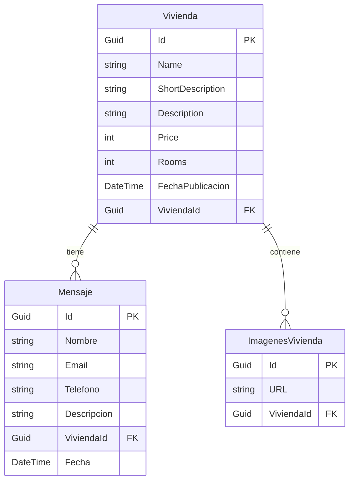

Provide project context and coding guidelines that AI should follow when generating code, answering questions, or reviewing changes.

# Documentación de Modelos

## Modelos Principales

### 1. Vivienda

La entidad `Vivienda` representa un inmueble en el sistema. Es el modelo central de la aplicación.

### Propiedades Principales:

- **Identificación**
    - `Id` (Guid): Identificador único generado automáticamente
    - `Name` (string): Nombre del inmueble (máx. 200 caracteres)
    - `FechaPublicacion` (DateTime): Fecha de publicación del anuncio
- **Descripción**
    - `ShortDescription` (string): Descripción breve (máx. 300 caracteres)
    - `Description` (string): Descripción detallada completa
- **Características Físicas**
    - `Price` (int): Precio del inmueble
    - `Rooms` (int): Número de habitaciones
    - `BathRooms` (int): Número de baños
    - `Garage` (int): Número de plazas de garaje
    - `SquaredMeters` (int): Metros cuadrados
- **Ubicación**
    - `Provincia` (string): Provincia (máx. 100 caracteres)
    - `Poblacion` (string): Población (máx. 100 caracteres)
    - `Calle` (string): Calle (máx. 100 caracteres)
    - `Numero` (string): Número (máx. 20 caracteres)
- **Clasificación**
    - `TipoInmueble` (enum): Tipo de inmueble
    - `TipoVivienda` (enum): Tipo específico de vivienda
    - `Estado` (enum): Estado de conservación
    - `Planta` (enum): Planta donde se ubica
    - `Tipo` (enum TipoAnuncio): Venta o Alquiler
    - `EstadoVenta` (enum): Estado de la operación
- **Características Adicionales**
    - `Caracteristicas` (List<Caracteristica>): Lista de características especiales
    - `IMGURL` (List<string>): URLs de imágenes
    - `Published` (bool): Indica si está publicado

### 2. Mensaje

La entidad `Mensaje` representa los mensajes de contacto relacionados con las viviendas.

### Propiedades:

- **Identificación**
    - `Id` (Guid): Identificador único
    - `Fecha` (DateTime): Fecha y hora del mensaje
- **Datos del Contacto**
    - `Nombre` (string): Nombre del interesado (máx. 100 caracteres)
    - `Email` (string): Correo electrónico (máx. 100 caracteres)
    - `Telefono` (string): Teléfono (máx. 20 caracteres)
- **Contenido**
    - `Asunto` (string): Asunto del mensaje (máx. 200 caracteres)
    - `Descripcion` (string): Contenido del mensaje (máx. 500 caracteres)
- **Control**
    - `Estado` (EstadoDelMensaje): Estado del mensaje
    - `Pinned` (bool): Si el mensaje está fijado/destacado
    - `ViviendaId` (Guid): Referencia a la vivienda

### **3. ImagenesVivienda**

- Guid Id PK
- string URL
- Guid ViviendaId FK
- int orden

## Enumeraciones (Enums)

### Roles y Permisos

- **UserRole**: Admin,User,Captador,Seller.

### Clasificación de Inmuebles

- **TipoInmueble**: Vivienda, Oficina, Local, Nave, Garaje, Terreno, Trastero, Edificio, ObraNueva
- **TipoVivienda**: Piso, Ático, Dúplex, Casa, Chalet, Villa, Masía, Finca, Loft
- **TipoCasa**: Independiente, Pareada, Adosada, Rústica, Moderna

### Operaciones

- **Accion**: Alquiler, Compra, Venta, ObraNueva
- **TipoAnuncio**: Venta, Alquiler
- **CTAType**: Compra, Vende

### Estados

- **Estado**: ObraNueva, BuenEstado, AReformar
- **EstadoDeLaVenta**: Disponible, Reservada, Vendida, Cerrada
- **EstadoDelMensaje**: Nuevo, EnCurso, Cerrado

### Características y Ubicación

- **Planta**: UltimaPlanta, PlantaIntermedia, Bajo
- **Caracteristica**: AireAcondicionado, ArmariosEmpotrados, Ascensor, Balcón, Terraza, Exterior, Garaje, Jardín, Piscina, Trastero, ViviendaAccesible, VistasAlMar, ViviendaDeLujo, VistasAMontaña, FuegoATierra, Calefacción, Guardilla, CocinaOffice

## Relaciones entre Modelos

### Descripción de las Relaciones

1. **Vivienda - Mensaje** (1:N)
    - Una vivienda puede tener múltiples mensajes de interesados
    - Cada mensaje está asociado a una única vivienda
    - Relación establecida mediante `ViviendaId` como clave foránea
2. **Vivienda - ImagenesVivienda** (1:N)
    - Una vivienda puede tener múltiples imágenes
    - Cada imagen pertenece a una única vivienda

## Consideraciones Técnicas

## Flujo de Datos

1. **Publicación**: Un administrador crea una nueva `Vivienda` con toda su información
2. **Visualización**: Los usuarios pueden ver las viviendas publicadas
3. **Contacto**: Los interesados envían `Mensajes` asociados a una vivienda específica
4. **Gestión**: Los administradores gestionan el estado de las viviendas y responden mensajes

Este sistema proporciona una estructura robusta para la gestión de anuncios inmobiliarios con un enfoque en la integridad de datos y la facilidad de uso.